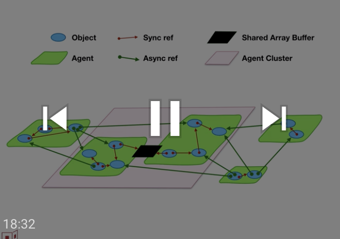

# proposal-oom-fails-fast

## Out-of-memory MUST immediately terminate the agent cluster

by Mark S. Miller (@erights) and J.F. Paradis (@jfparadis)

## Status

Presented to TC39 (Javascript standards committee), achieving stage 1.

## Summary

The ECMAScript specification nowhere mentions the possibility of running out of memory (OOM), and so cannot be correctly implemented on finite memory machines. Allocation in JavaScript is pervasive and implicit, implying that an OOM may happen anywhere in the execution of the program. If OOM threw a catchable error, computation within the agent would continue in an inconsistent state. Instead, we should immediately terminate the agent cluster, in order to abandon all unrepairable inconsistent state.

## Background

JavaScript programs, like programs in any conventional imperative programming language, must bring about state change one step at a time. Between these steps, invariants are suspended, to be restored by later steps. Consider splicing into a doubly-linked list. No matter how it is written, part way through the splice, the doubly-linked list is in an ill-formed state. Were the remaining steps skipped unpredictably, and computation to continue elsewhere with the ill-formed list still reachable, [Zalgo would be unleased](https://blog.izs.me/2013/08/designing-apis-for-asynchrony).

[Erlang](http://erlang.org/download/armstrong_thesis_2003.pdf) and [Joe-E](https://people.eecs.berkeley.edu/~daw/papers/joe-e-ndss10.pdf) instead implement the fail-fast approach, in which a computational unit containing all such potentially inconsistent state, is immediately terminated. Let's call this computation unit the Unit of Preemptive Termination (UOPT). No further code executes within the UOPT. The potentially unrepaired inconsistent state is abandoned, no longer reachable by any computational path that may continue. In Erlang, the UOPT is tiny: the Erlang process. This is possible because processes are only asynchronously coupled to each other by messages, and only synchronously coupled to each other through transactional database abstractions.

In JavaScript, the minimal UOPT is the agent cluster. Following OOM, the agent cluster must be immediately terminated, without any further execution of user code within the agent cluster. Any recovery of an overall computational system must occur in other code, in reaction to the termination of this agent cluster. Erlang shows this approach is practical for writing systems that maintain consistency.

## Can the UOPT be finer grain than an agent cluster?

An individual agent would be a much more natural UOPT than an agent cluster. In the absence of Shared Array Buffers (SABs), JavaScript event loops would be just as loosely coupled as Erlang's so-called shared nothing processes. If the agent that must be terminated is communicating with other agents through SABs when it is terminated, can the SAB be instantly killed, so other agents may be deadlocked rather than inconsistent? If not, can we just kill the other agents that are actually in danger of corruption, rather than all agents that are potentially in danger of corruption? Can we at least limit the termination to the transitive closure of agents that have ever shared a SAB with this one?

Can we allow some kind of opt-in to more dangerous termination, such that those programs that would prefer corrupted progress to clean termination can do so?

## Recovering from OOM

How does such termination manifest in actual systems? Page refresh? Dead tabs? Device reboot? How does the overall computational system continue after this termination? Can JavaScript provide a standard way to arrange for some code to be in the position to react to the termination of other code?

Any such recovery code must itself be outside the UOPT. None of the potentially corrupted state should be reachable from the recovery code. This is similar to the post-mortem finalization architecture of WeakRefs, where none of the condemned objects is reachable from the finalization code.

Since the termination is caused by running low on memory, any recovery code should have its own separately allocated memory resources, or at least an emergency reserve.

----

From  [Joe-E: A Security-Oriented Subset of Java](https://people.eecs.berkeley.edu/~daw/papers/joe-e-ndss10.pdf), Adrian Mettler, David Wagner, and Tyler Close; January 2010:

> ... an object’s invariants can be violated if an error (such as running out of memory) is encountered during execution right when the object is in a temporarily inconsistent state. In many cases, these errors can be intentionally triggered by the invoking software component, for example by allocating a lot of memory or recursing deeply to use up stack space before invoking the object under attack. If a malicious caller could catch such an error, the caller would be
well-positioned to exploit the violated invariant.
